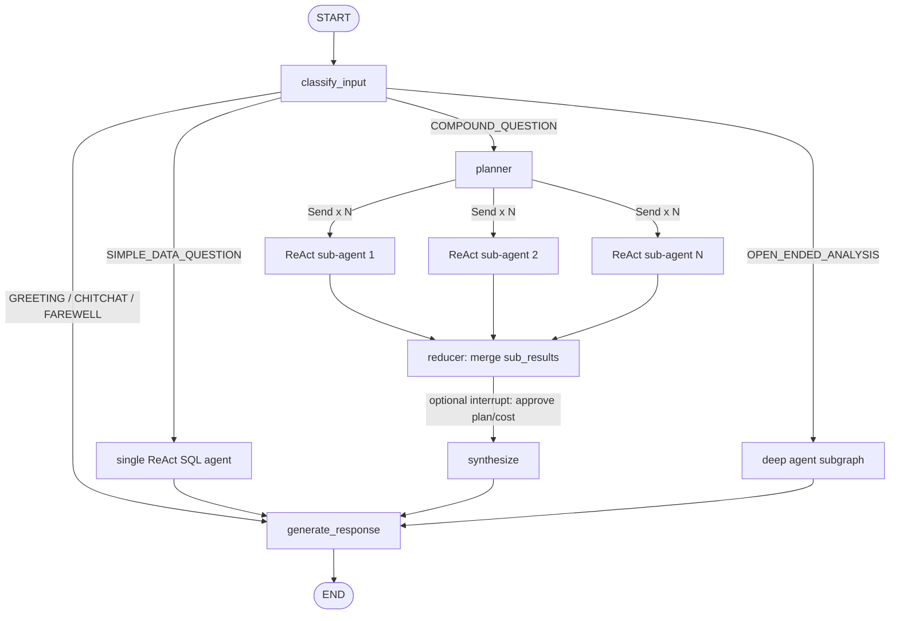

# Architecture

## Graph topology



The four branches after `classify_input` exist because they need genuinely different
execution shapes, not because more branches look more sophisticated:

- **Simple question** → one ReAct agent, one tool loop. Adding fan-out or planning here
  would be pure overhead.
- **Compound question** → needs to be split into independent sub-questions that don't
  depend on each other's output, which is exactly what `Send`-based fan-out + a reducer
  is for.
- **Open-ended analysis/report** → the task is long-horizon, needs intermediate
  artifacts (draft SQL, draft prose), and its own sub-agent delegation. This is the
  deep-agent shape, not the ReAct shape.

## State schema

```python
class AnalystState(TypedDict):
    question: str
    input_type: str                                   # classifier output
    plan: NotRequired[list[SubTask]]                   # sub-questions + assigned agent
    sub_results: Annotated[list[SubResult], operator.add]  # reducer: parallel fan-in
    response: NotRequired[str]
    thread_id: str                                     # short-term memory scope
    user_id: str                                        # long-term memory scope
```

`sub_results` is the one field that actually needs a custom reducer: multiple parallel
branches write to it concurrently, and LangGraph needs to know to *append* rather than
*overwrite*. Every other field is single-writer, so a plain replace is correct and a
custom reducer there would just be noise.

## Memory design

Two distinct stores, because they answer two distinct questions ("what did we just say"
vs "what do we permanently know"), and LangGraph gives us two distinct primitives for
exactly that split:

### Short-term — checkpointer

- Backing: `SqliteSaver` (swap for Postgres later if concurrent users demand it).
- Scope: keyed by `thread_id` — one thread per Streamlit session/conversation.
- Holds: the full `AnalystState` after each turn, so follow-up questions ("break that
  down by quarter") resume from prior turns without resending history.
- Lifetime: conversation-length. Fine to prune/expire.

### Long-term — Store

- Backing: `InMemoryStore` for dev, a SQLite/Postgres-backed store for anything
  persistent across process restarts.
- Scope: namespaced by `user_id` (or globally, for facts that are DB-wide truths).
- Holds three kinds of durable facts:
  1. **Schema graph** — computed once via SQLAlchemy reflection (see
     [INSIGHTS.md](INSIGHTS.md) for why this replaced LLM-guessed schema discovery),
     cached indefinitely and invalidated only when the DB's schema version/hash changes.
  2. **Business glossary** — facts learned mid-conversation ("'active user' means
     logged in within 30 days") that should apply to all future sessions, not just the
     current thread.
  3. **Report recall** — summaries of past deep-agent report runs, so "what did we find
     about Q3 last time" doesn't require rerunning the analysis.

## Parallel execution + reducer, concretely

For a compound question, the planner node emits one `Send("react_subagent", {...})`
per independent sub-question. Each spawned `react_subagent` run is stateless with
respect to the others — they don't share or block on each other's state — and each
returns into `sub_results` via the `operator.add` reducer. A `synthesize` node then
runs once all branches have joined, combining the partial answers into one response.
This is the standard LangGraph map-reduce pattern; no custom concurrency handling is
needed beyond declaring the reducer correctly.

## Deep agent

Used only for the `OPEN_ENDED_ANALYSIS` branch. Built from the same four ingredients
any deep-agent implementation needs:

- A **planning tool** — breaks the report request into ordered steps.
- A **virtual file system** (write/read/edit file tools) — used as scratch space for
  draft SQL, intermediate result tables, and the evolving report markdown, so long
  outputs don't have to live entirely in the LLM context window.
- A **sub-agent spawner** (`task`-style tool) — delegates bounded sub-investigations
  (e.g. "get me regional revenue for Q3") to a fresh ReAct-style agent instance.
- A **detailed system prompt** describing the analyst's role, house style for reports,
  and guardrails (read-only DB access — see below).

## Safety

The original DataScribe notebook's disclaimer ("it is possible for it to attempt
INSERT/UPDATE/DELETE") is treated as a real constraint here, not a warning label:

- The DB connection used by all agents is a **read-only** SQLite connection/user.
- A query-checker tool step rejects any non-`SELECT` statement before execution,
  independent of the read-only connection (defense in depth).

## Tech stack

| Concern | Choice | Why |
|---|---|---|
| Orchestration | LangGraph (`StateGraph`, `Send`, `Store`, checkpointer) | Native support for every primitive this project needs |
| Agents | `langgraph.prebuilt.create_react_agent`, `deepagents` | Modern replacement for `AgentExecutor`/`create_tool_calling_agent` |
| LLM | Groq (`langchain-groq`) | Already used in DataScribe; fast + cheap for iterative dev |
| DB | SQLite (`ani.db`), SQLAlchemy reflection | Reuses existing data; no LLM-guessed schema |
| Long-term store | LangGraph `Store` (SQLite/Postgres-backed) | Durable cross-session memory |
| Short-term store | LangGraph checkpointer (`SqliteSaver`) | Per-thread conversation persistence |
| UI | Streamlit | Requested target UI |
